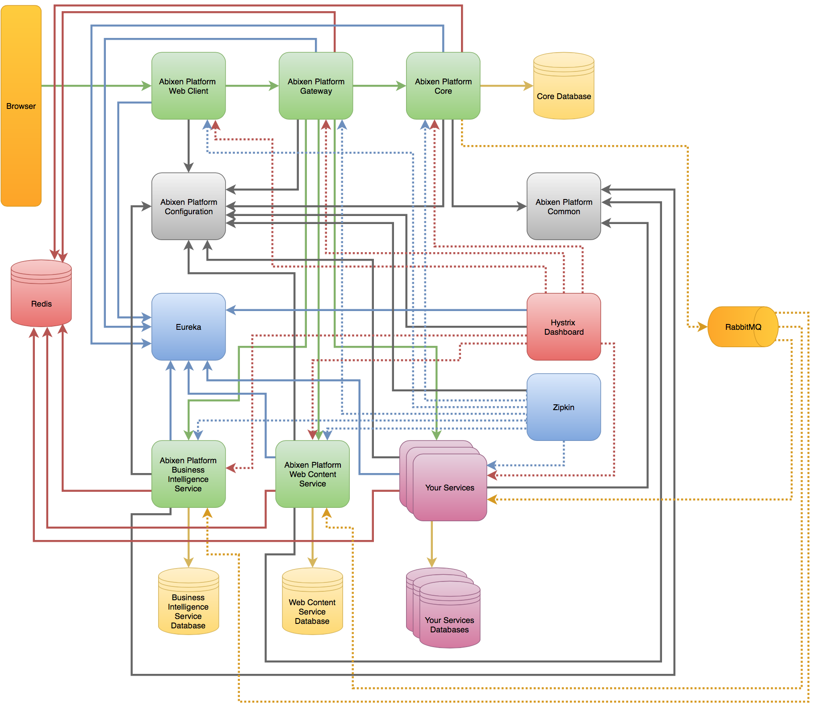
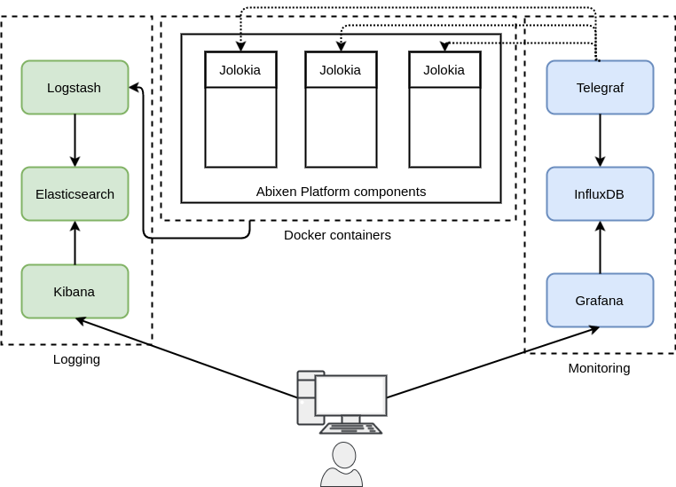

# What is Abixen Platform

## Short introduce
Abixen Platform is a microservices based software platform for building enterprise applications. 
The main goal of the project is a creation of functionalities through creating particular microservices and integrating by provided CMS.

All you have to do in order to create an entirely new functionality is to implement a new, separated microservice.
Now you can register it in Abixen Platform and start using by delivered configuration wizards and CMS.
There is also an Abixen Platform API, which allows you to accelerate the process of new microservices creation.

Abixen Platform's organizational division consists of pages and modules. 
User with appropriate privileges can create any page and select a layout. 
Finally, add to the page instances of modules deployed on Abixen Platform. 
Each of the modules can have many instances, configured by different parameters.

One of the most important mechanisms built-in into Abixen Platform is own security system, which
ensures a full control access to pages, modules and even the data displayed and used by the modules.
		
Abixen Platform delivers out of the box functional microservices. 
		
**Business Intelligence Service is one of the delivered functional modules.**

This module allows to do reporting charts and tables. A business administrator can create the charts and feed it by a following flow:
* Create a database connection to one of supported databases (H2, MySQL, PostgreSQL, Oracle, MSSQL). Instead of database connection, there is an opportunity to use an excel or CSV file
* Create a data source using above database connection or file.
* Add a new business intelligence instance on a page
* Configure a chart series selecting a data source
* Set permissions for particular users' roles

**Web Content Service is another one of the delivered functional modules.**

This module allows to do articles. A business administrator can create articles in two ways:
* Simple Web Content (just fill out a simple form with rich text editor)
* Advanced Web Content (using structures and templates)
		
The spectrum of possible modules developer can create is unlimited. 
There can be e.g. modules showing data in a tabular way, modules of data entry, 
where users enter data, edit and present.
		
The main architectural emphasis was placed on the rapid creation of new modules. 
Therefore, an original architecture has been implemented based on microservices, which
allows to create modules functionally independent of the other elements. 
When programmer creates a module, compiles only his module and his microservice. 
This provides a tremendous time saving comparing to monolithic systems.

## Technology stack

## Architecture overview
One of the biggest advantage is the architecture based on microservices concept. 
With loosely coupled components, it opens up a possibility of a efficient division of work between development teams and for a simple and inexpensive system maintenance.
Creating a new module, a new functionality, a developer must not interfere with the existing source code. He can create a new microservice, being a separate spring boot application. 
Then, implementing necessary interfaces achieves opportunity to integrate the newly created microservice with Abixen Platform structure.
Finally, a business administrator may use it over the platform.
Abixen Platform supplies out of the box a few functional modules closed in the Business Intelligence Service and in the Web Content Service.
This is a good example, how to create the own microservice.
Mentioned services provide mainly visualisation functionalities, such as charts, micro charts, KPIs. As well as a web content management, such as templates, structures, articles.
However opportunities to develop data entry modules are still opened!

## AWS compatible
Abixen Platform is fully compatible with AWS cloud and utilizes the following services:

   * **EC2** - used as a base for hosts running docker in ECS Cluster
   * **ALB** - modern version of load balancer aligned with microservices architecture topology
   * **ECS** - container orchestrator and scheduler for all services running as docker containers
   * **ECR** - private container registry for docker images
   * **Route53** - allows to use internal dns names for communication between microservices
   * **CloudWatch** - used as a central monitoring and logging
   * **Elasticache** - used internally by Abixen Platform components
   * **RDS** - database store for all components
   * **SES** - used for email communication
   

## Logging and monitoring
All containers from Abixen Platform send logs to [Elasticsearch](https://www.elastic.co) via [Logstash](https://www.elastic.co/products/logstash). You can use [Kibana's](https://www.elastic.co/products/kibana) interface as well.
All metrics are exposed on each component with [Jolokia](http://jolokia.org) and fetched from there using [Telegraf](https://influxdata.com/telegraf-correlate-log-metrics-data-performance-bottlenecks/). They are sent to [InfluxDB](https://influxdata.com/) and are accessible on [Grafana](https://grafana.net) dashboards

# History

Abixen Platform has been started in March 2015 by Mariusz Kumor (<a href="https://www.linkedin.com/in/mariuszkumor">see LinkedIn profile</a>). 
Preliminary the main idea was to learn more about microservices, 
Spring Cloud stuff and extend knowledge about AngularJS.
The project was developing to December 2015 at free time.
Substantial part of the time involved analysis and prototypes. 
Since that day it took some time but now, 
in October 2016 he decided to publish the source code on GitHub. 
As well Mariusz Kumor decided to begin further development.
The great motivation were flattering words of his friends, 
also some companies about the project and its ideas.

# Known issues

There are some known issues. We work on fixes and improvements.

* Not all security parts have yet been implemented
* Not all translations are done
* Multi Visualisation Service needs some user interface improvement and optimization. Also needs more tests.
* Web Content Service has yet been finished
* In some places CSS is not perfect
* There is a small technical debt (non functional issue)

# Release plan

## Version 1.0
Before release the first version of Abixen Platform we have to fix several issues.
We are going to release the first version in May 2017. 

## Version 1.1
We are going to add a support to loading data in Business Intelligence microservice from MongoDB.
Very important for us is a feedback from the Abixen Platform's Community. 
That's why we would like to improve the application having remarks based on the first version.
The release is planned in June 2017.

## Version 1.2
This version will bring a support for Angular 2. 
Developers will get an opportunity to develop their custom functional microservices using Angular 2. 
Also a next part of improvements and bug fixes.
The release is planned for the Q3 2017.

## Version 1.3
The plan for the 1.3 version is an empower of custom permissions creation for microservices. 
The release is planned for the Q3 2017.

## Next versions
All depends on the Community feedback and needs. But we are going to extend Business Intelligence Service moving it into Big Data analysis.
Also we would like to add a support of creation a frontend layer of microservices using ReactJS.
In this way developers would have the choice between clear JavaScript, jQuery, AngularJS, Angular 2 and ReactJS. 

# Get it started
The documentation is available under https://github.com/abixen/abixen-platform/wiki page.

# We are looking for experienced Contributors
Are you good at Java and / or frontend technologies like AngularJS, CSS, HTML?
Or maybe are you an UI/UX expert and you are willing to enhance Abixen Platform's design?
Would you like to join geek guys? 
If so, we are ready to do short but powerful training for you from Abixen Platform.
After the training you will be able to develop together with us the amazing Abixen Platform.
Just mail us **info@platform.abixen.com**. In a message please let us know, why would you like to contribute and what could you bring to the project.

# How to contribute to the repository
Contributors wanted to join Abixen Platform project have to comply with a few rules: 

* A preferred IDE is IntelliJ IDEA with default formatting styles
* Committed source code must be high quality
* Committed source code must be formatted
* A commit has to solve an issue from the product backlog (if missing the issue there, please add previously)
* In order to start contribution, a contributor has to fork the project
* Once an issue is fixed, a contributor has to create a commit to his forked repository
* In order to merge changes to the project repository, contributor has to create a pull request with the only one commit.  

# License

Copyright (c) 2010-present Abixen Systems. All rights reserved.
 
This library is free software; you can redistribute it and/or modify it under
the terms of the GNU Lesser General Public License as published by the Free
Software Foundation; either version 2.1 of the License, or (at your option)
any later version.

This library is distributed in the hope that it will be useful, but WITHOUT
ANY WARRANTY; without even the implied warranty of MERCHANTABILITY or FITNESS
FOR A PARTICULAR PURPOSE. See the GNU Lesser General Public License for more
details.