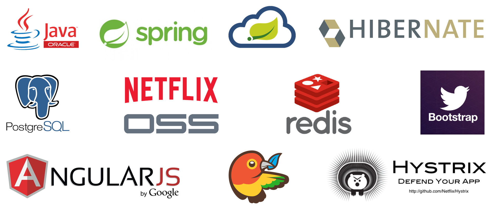
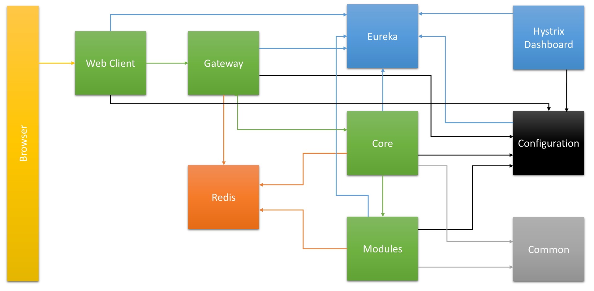
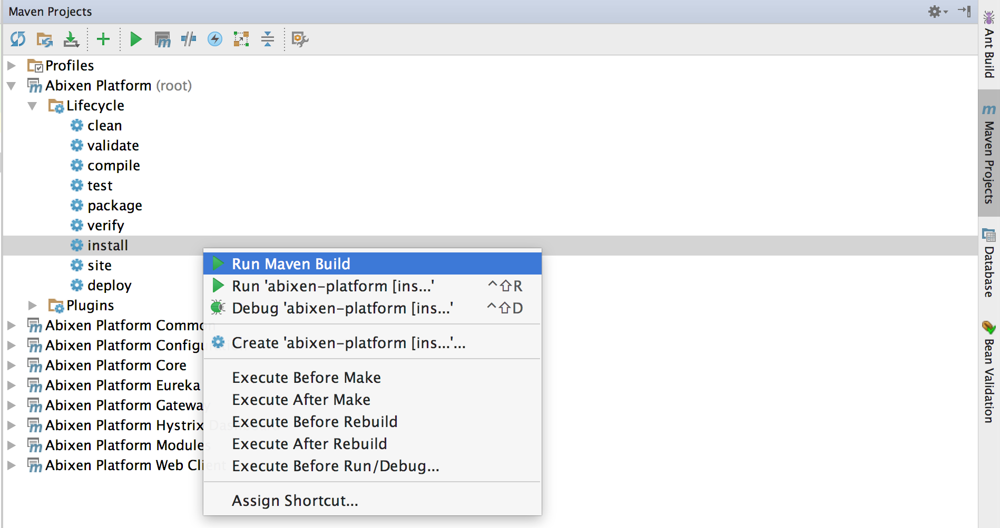
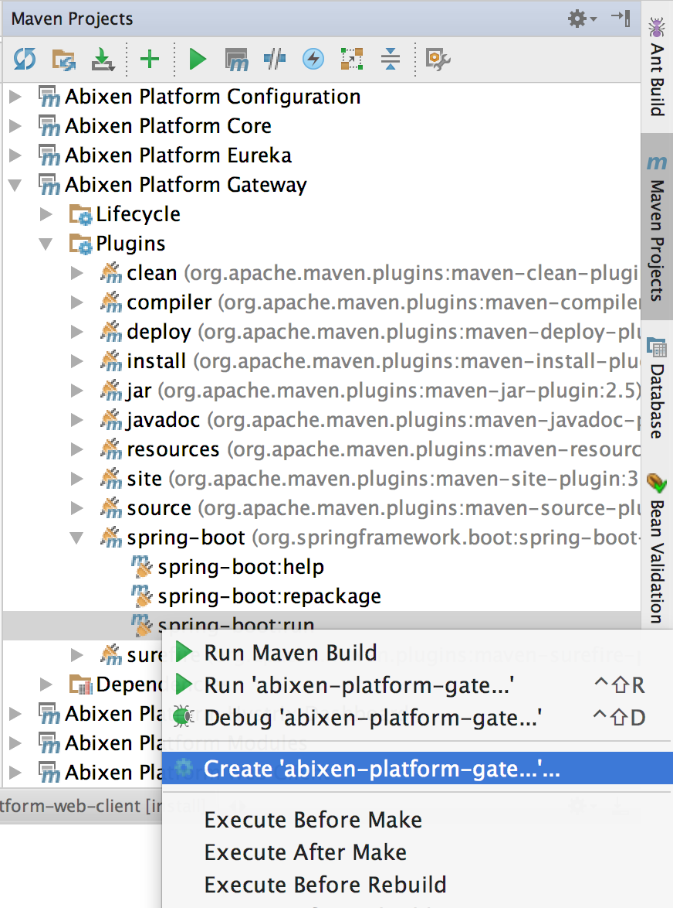
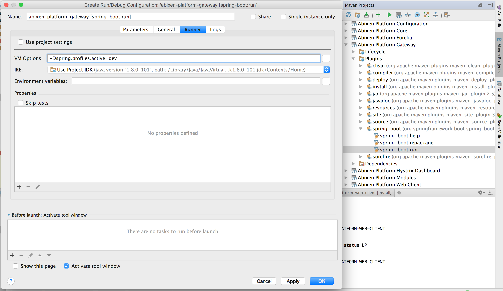
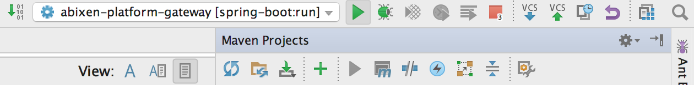
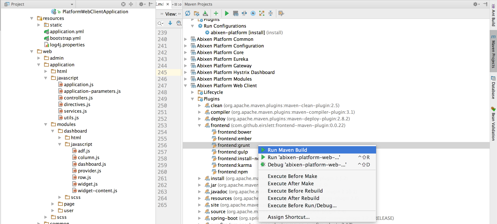

#What is Abixen Platform

##Short introduce
Abixen Platform is a microservices based software platform for building enterprise applications. 
The main goal of the project is a creation of functionalities through creating particular microservices and integrating by provided CMS.

##Technology stack


##Architecture overview
One of the biggest advantage is the architecture based on microservices concept. 
With loosely coupled components, it opens up a possibility of a efficient division of work between development teams and for a simple and inexpensive system maintenance.
Creating a new module, a new functionality, a developer must not interfere with the existing source code. He can create a new microservice, being a separate spring boot application. 
Then, implementing necessary interfaces achieves opportunity to integrate the newly created microservice with Abixen Platform structure.
Finally, a business administrator may use it over the platform.
Abixen Platform supplies out of the box a few functional modules closed in the Modules microservice.
This is a good example, how to create the own microservice.
Mentioned Modules provide mainly visualization functionalities, such as charts, micro charts, KPIs.
However opportunities to develop data entry modules are still opened!


#History

Abixen Platform has been started in March 2015 by Mariusz Kumor (<a href="https://www.linkedin.com/in/mariuszkumor">see LinkedIn profile</a>). 
Preliminary the main idea was to learn more about microservices, 
Spring Cloud stuff and extend knowledge about AngularJS.
The project was developing to December 2015 at free time.
Substantial part of the time involved analysis and prototypes. 
Since that day it took some time but now, 
in October 2016 he decided to publish the source code on GitHub. 
As well Mariusz Kumor decided to begin further development.
The great motivation were flattering words of his friends, 
also some companies about the project and its ideas.

#Known issues and refactor needs
It's hard to say there are any open issues once development is still in progress. 
However there are some rector needs at this time.
Preliminary we have to focus on following refactor and changes:

* Change AngularJS style to Papa Style
* Apply Lombok library on Java side
* Migrate to Liquibase

In relation to issues, there will be worth to talk about them once refactor and several features described in the section below will be done.

#Release plan

Before release the first version of Abixen Platform we have to finish several features, such as:

* Improve security model
* Finish chart module
* Solve major issues
* Perform refactor described above

We are going to release the first version in January 2017. 

The next known plans take into account inter alia:

* Migrate microservices to Docker
* Test and adjust to Amazon Web Services

#Get it started

##Requirements

* Java 8
* Redis
* Maven 3.1.0+
* GIT added to the path
* Internet connection to download maven, npm and bower dependencies 

##Build the project
At the first clone the project from GitHub. 
If you are going to start development process, then the best option will be run from IDE environment.
We recommend IntelliJ IDEA. 
Section **Setup development IDE** aims at showing how to start project in IntelliJ IDEA.
If you wish to only run project, without development, please follow the below steps. 

In a terminal go to the project directory and execute:

```
mvn install -DskipTests=true
```
Maven should download all required dependencies, both java libraries and using Maven Frontend Plugin trigger the bower ones downloading process.
Temporary there is an test issue, that is why the skip tests is needed. The issue will be fixed.

##Run particular microservices

###Run Eureka

```
java -jar abixen-platform-eureka/target/abixen-platform-eureka.jar
```
In a browser go to address http://localhost:8761 and if you can see the Eureka's page, go to the next step. 
###Run Configuration Server

Go to the abixen-platform-core.yml in the abixen-platform-configuration microservice.
Set a correct absolute path of the imageLibraryDirectory property. In the future this config will be improvement.
In example like this:

```
imageLibraryDirectory: /Users/MariuszKumor/workspace/projects/github/abixen-platform/data/image-library/
```
```
java -jar abixen-platform-configuration/target/abixen-platform-configuration.jar
```
Refresh the Eureka's page and check if the ABIXEN-PLATFORM-CONFIGURATION has been registered. 
(the section Instances currently registered with Eureka)
If yes, go to the next step.
###Run Hystrix Dashboard
This microservice is not required and may be omitted, 
taking into account the Hystrix Dashboard allows to monitor a network traffic between microservices.

```
java -jar abixen-platform-hystrix-dashboard/target/abixen-platform-hystrix-dashboard.jar
``` 
Refresh the Eureka's page and check if the ABIXEN-PLATFORM-HYSTRIX-DASHBOARD has been registered.
If yes, go to the next step.
###Run Gateway

Gateway requires Redis installed and running. On the below URL address there is a sample how to install Redis on Mac OS X
http://jasdeep.ca/2012/05/installing-redis-on-mac-os-x
And here there is a source of Redis for Windows 
https://github.com/MSOpenTech/redis/releases

```
java -Dspring.profiles.active=dev -jar abixen-platform-gateway/target/abixen-platform-gateway.jar
```
Refresh the Eureka's page and check if the ABIXEN-PLATFORM-GATEWAY has been registered.
If yes, go to the next step.

###Run Modules

```
java -Dspring.profiles.active=dev -DcreateDbSchema=true -jar abixen-platform-modules/target/abixen-platform-modules.jar
```
Refresh the Eureka's page and check if the ABIXEN-PLATFORM-MODULES has been registered.
If yes, go to the next step.

###Run Core
 
```
java -Dspring.profiles.active=dev -DcreateDbSchema=true -jar abixen-platform-core/target/abixen-platform-core.jar 
```
Refresh the Eureka's page and check if the ABIXEN-PLATFORM-CORE has been registered.
If yes, go to the next step.
###Run Web Client

```
java -Dspring.profiles.active=dev -jar abixen-platform-web-client/target/abixen-platform.war
```
Refresh the Eureka's page and check if the ABIXEN-PLATFORM-WEB-CLIENT has been registered.
If yes, in a browser go to the address http://localhost:8080 and sign in to the platform.
There are three initial users:

* username *admin* and password *password*
* username *user* and password *password*
* username *editor* and password *password*

#Setup development IDE
For development work can start above microservices in the development environment,
following below steps.

##Build the project
At the first open the project in IntelliJ IDEA. Then, click the right mouse button on the install option and select Run maven build: 



Maven should download all required dependencies, both java libraries and using Maven Frontend Plugin trigger the bower ones downloading process.
Temporary there is an test issue, that is why the skip tests is needed. The issue will be fixed.

##Run particular microservices

###Run Eureka


In a browser go to address http://localhost:8761 and if you can see the Eureka's page, go to the next step. 
###Run Configuration Server
Go to the abixen-platform-core.yml in the abixen-platform-configuration microservice.
Set a correct absolute path of the imageLibraryDirectory property. In the future this config will be improvement.
In example like this:

```
imageLibraryDirectory: /Users/MariuszKumor/workspace/projects/github/abixen-platform/data/image-library/
```

Similarly as Eureka, start Abixen Platform Configuration microservice.
Refresh the Eureka's page and check if the ABIXEN-PLATFORM-CONFIGURATION has been registered. 
(the section Instances currently registered with Eureka)
If yes, go to the next step.
###Run Hystrix Dashboard
This microservice is not required and may be omitted, 
taking into account the Hystrix Dashboard allows to monitor a network traffic between microservices.

Similarly as Eureka, start Abixen Platform Hystrix Dashboard microservice.
Refresh the Eureka's page and check if the ABIXEN-PLATFORM-HYSTRIX-DASHBOARD has been registered.
If yes, go to the next step.
###Run Gateway

Gateway requires Redis installed and running. On the below URL address there is a sample how to install Redis on Mac OS X
http://jasdeep.ca/2012/05/installing-redis-on-mac-os-x
And here there is a source of Redis for Windows 
https://github.com/MSOpenTech/redis/releases

Click the right mouse button on the spring-boot:run option and select create abixen-platform-gateway one: 



In the opened window put VM option -Dspring.profiles.active=dev



Save changes, and run:



Refresh the Eureka's page and check if the ABIXEN-PLATFORM-GATEWAY has been registered.
If yes, go to the next step.

###Run Modules

Go to similar steps as Abixen Platorm Gateway. 
Set JVM variables -Dspring.profiles.active=dev -DcreateDbSchema=true

Refresh the Eureka's page and check if the ABIXEN-PLATFORM-MODULES has been registered.
If yes, go to the next step.

###Run Core
 
Go to similar steps as Abixen Platorm Gateway. 
Set JVM variables -Dspring.profiles.active=dev -DcreateDbSchema=true

Refresh the Eureka's page and check if the ABIXEN-PLATFORM-CORE has been registered.
If yes, go to the next step.
###Run Web Client

Go to similar steps as Abixen Platorm Gateway. 
Set JVM variables -Dspring.profiles.active=dev

Refresh the Eureka's page and check if the ABIXEN-PLATFORM-WEB-CLIENT has been registered.
If yes, in a browser go to the address http://localhost:8080 and sign in to the platform.
There are three initial users:

* username *admin* and password *password*
* username *user* and password *password*
* username *editor* and password *password*

#Dealing with static resources
The are static resources in the Web Client and the Modules microservices.
A developer have to modify files in the web directory. 
Once some changes has been done,
running the grunt task from the Maven Frontend Plugin, resources are processing and putting into static directory.
Don't modify a content of the static directory - it is overwritten every time, once the grunt task is performed.
Refresh a browser after the grunt task is finished.




#License

Copyright (c) 2010-present Abixen Systems. All rights reserved.
 
This library is free software; you can redistribute it and/or modify it under
the terms of the GNU Lesser General Public License as published by the Free
Software Foundation; either version 2.1 of the License, or (at your option)
any later version.

This library is distributed in the hope that it will be useful, but WITHOUT
ANY WARRANTY; without even the implied warranty of MERCHANTABILITY or FITNESS
FOR A PARTICULAR PURPOSE. See the GNU Lesser General Public License for more
details.


#FAQ
* I'm getting "[ERROR] bower angular-svg-round-progressbar#0.3.8 ENOGIT git is not installed or not in the PATH when try start abixen-platform-modules". Why?

    *You are getting this error, because you don't have installed git or your configuration of path (on Windows) is default.
    On Windows you should have in the path two variables "<You path to git folder>\Git\cmd" (is default) and "<You path to git folder>\Git\bin" (it isn't default).
    Add the not default variable and it should work. Please remember if you are changing the path when your IDE is running then you need to restart IDE.*
    
* Abixen Platform Gateway can't save data in the redis.

    *Please run the redis server with the administrator right.*
    
* I did some many good works on the front-end side in the abixen-platform-web-client and I lost it.

    *Probably, you are working in "resource/static" folder. This folder is the target of the grunt build task.
    Every change should be done in the "web" folder. Files from this folder will be auto built to the "static" folder*
