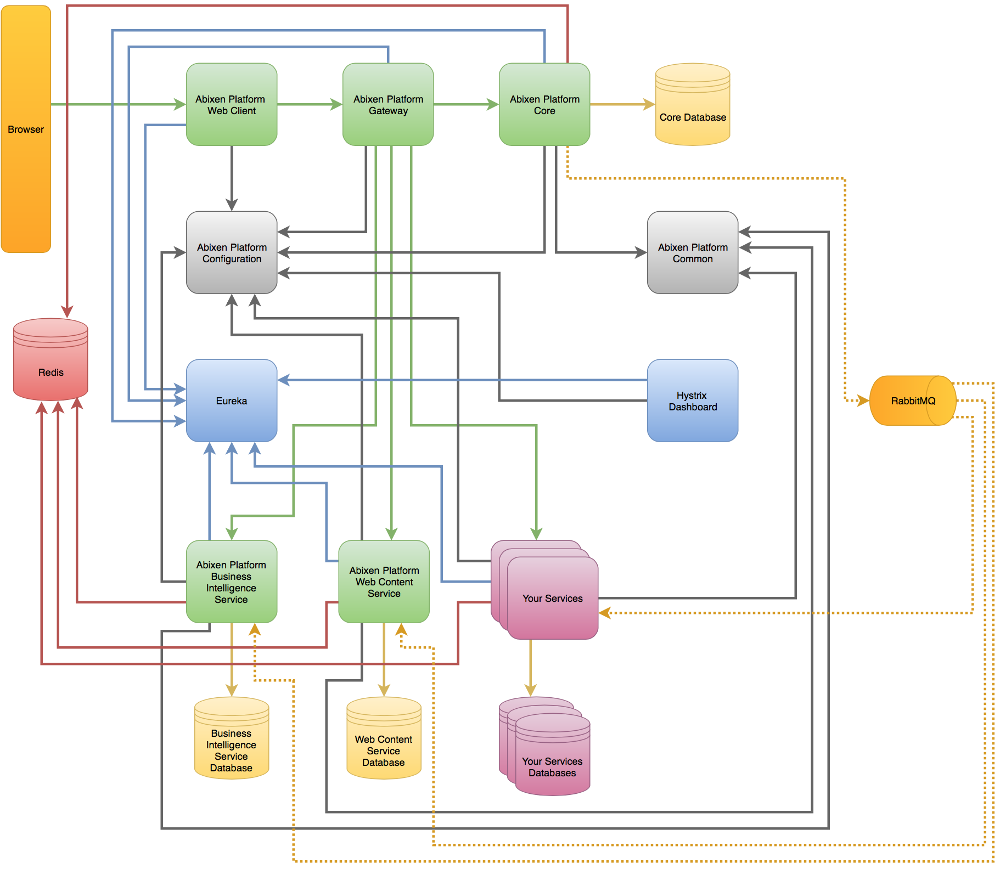

#What is Abixen Platform

##Short introduce
Abixen Platform is a microservices based software platform for building enterprise applications. 
The main goal of the project is a creation of functionalities through creating particular microservices and integrating by provided CMS.

##Technology stack

##Architecture overview
One of the biggest advantage is the architecture based on microservices concept. 
With loosely coupled components, it opens up a possibility of a efficient division of work between development teams and for a simple and inexpensive system maintenance.
Creating a new module, a new functionality, a developer must not interfere with the existing source code. He can create a new microservice, being a separate spring boot application. 
Then, implementing necessary interfaces achieves opportunity to integrate the newly created microservice with Abixen Platform structure.
Finally, a business administrator may use it over the platform.
Abixen Platform supplies out of the box a few functional modules closed in the Modules microservice.
This is a good example, how to create the own microservice.
Mentioned Modules provide mainly visualization functionalities, such as charts, micro charts, KPIs.
However opportunities to develop data entry modules are still opened!

#History

Abixen Platform has been started in March 2015 by Mariusz Kumor (<a href="https://www.linkedin.com/in/mariuszkumor">see LinkedIn profile</a>). 
Preliminary the main idea was to learn more about microservices, 
Spring Cloud stuff and extend knowledge about AngularJS.
The project was developing to December 2015 at free time.
Substantial part of the time involved analysis and prototypes. 
Since that day it took some time but now, 
in October 2016 he decided to publish the source code on GitHub. 
As well Mariusz Kumor decided to begin further development.
The great motivation were flattering words of his friends, 
also some companies about the project and its ideas.

#Known issues and refactor needs
It's hard to say there are any open issues once development is still in progress. 
However there are some rector needs at this time.
Preliminary we have to focus on following refactor and changes:

* Change AngularJS style to Papa Style
* Apply Lombok library on Java side
* Migrate to Liquibase

In relation to issues, there will be worth to talk about them once refactor and several features described in the section below will be done.

#Release plan

Before release the first version of Abixen Platform we have to finish several features, such as:

* Improve security model
* Finish chart module
* Solve major issues
* Perform refactor described above

We are going to release the first version in January 2017. 

The next known plans take into account inter alia:

* Migrate microservices to Docker
* Test and adjust to Amazon Web Services

#Get it started
The documentation is available under https://github.com/abixen/abixen-platform/wiki page.

#How to contribute to the repository
Contributors wanted to join Abixen Platform project have to comply with a few rules: 

* An preferred IDE is IntelliJ IDEA with default formatting styles
* Committed source code must be high quality
* Committed source code must be formatted
* A commit has to solve an issue from the product backlog (if missing the issue there, please add previously)
* In order to start contribution, a contributor has to fork the project
* Once an issue is fixed, a contributor has to create a commit to his forked repository
* In order to merge changes to the project repository, contributor has to create a pull request with the only one commit.  

#License

Copyright (c) 2010-present Abixen Systems. All rights reserved.
 
This library is free software; you can redistribute it and/or modify it under
the terms of the GNU Lesser General Public License as published by the Free
Software Foundation; either version 2.1 of the License, or (at your option)
any later version.

This library is distributed in the hope that it will be useful, but WITHOUT
ANY WARRANTY; without even the implied warranty of MERCHANTABILITY or FITNESS
FOR A PARTICULAR PURPOSE. See the GNU Lesser General Public License for more
details.

#Faq
1) I getting "[ERROR] bower angular-svg-round-progressbar#0.3.8 ENOGIT git is not installed or not in the PATH when try start abixen-platform-modules". Why?

    You get this error, becouse you don't have installed git or your configuration of path (on Windows) is default.
    On Windows you should have in the path two variable "<You path to git folder>\Git\cmd" (is default) and "<You path to git folder>\Git\bin" (it isn't default).
    Add not default variable and should work. Please remember if you changing path when you IDE is started then you need to restart IDE.
    
2) Abixen-platform-gateway can't save data in redis.

    Please run redis server with administrator right.
    
3) I done some many good works on front-end side in abixen-platform-web-client and I lost it.

    Probable, you work in "resource/static" folder. This folder is target for grunt build task.
    Every change should be done in "web" folder. Files from this folder will be auto builded to "static" folder